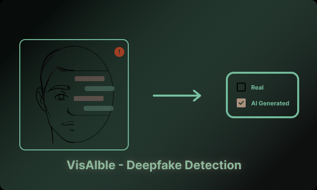
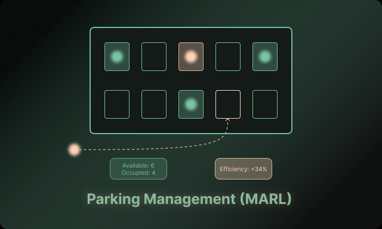

<!-- ==================== PROFILE HEADER ==================== -->

# 👋 Hi, I'm Anju Vilashni Nandhakumar  
### Senior ML Engineer | Computer Vision · NLP · Reinforcement Learning

🎓 **MS in Artificial Intelligence** @ Northeastern University (2025)  
⚙️ **3+ years** building production ML systems with PyTorch, TensorFlow & Docker  
📍 Boston, MA | Open to full-time AI/ML roles

---

## 💬 Bio
I design and deploy **production-grade AI systems** that bridge human intuition and machine reasoning.  
Passionate about **computer vision, NLP, reinforcement learning**, and building scalable ML pipelines that deliver measurable impact.

---

## 🌟 Senior Highlights
- 🚀 Reduced model inference latency by **20%** in production ML pipelines  
- 📦 Designed CI/CD + monitoring for multiple deployed models  
- 🤝 Led cross-functional engineering collaborations  
- 🔍 Built explainable AI systems for medical imaging & deepfake detection  
- 📊 Processed **150K+ samples** using transformer architectures  
- 🏆 Contributed to open-source ML libraries and Kaggle competitions  

---

<!-- ==================== LIVE WIDGETS ==================== -->

---

## 🛠 Tech Stack

**Machine Learning & AI:**  

**NLP:**  

**MLOps & Deployment:**  

---

## 🔬 Flagship Projects

Computer Vision

---

### 🖼 VisAIble – Deepfake Detection

  

**Tech:** PyTorch · EfficientNet-B0 · Grad-CAM · LIME  
📌 **Problem:** Enterprise deepfake detection  
🧠 **Approach:** EfficientNet + explainable AI overlays  
📈 **Impact:** 95%+ accurate  
📦 **Production:** Docker + Streamlit deployment  
🔧 **Learnings:** GPU optimization & human-AI collaboration  
🔗 [Demo](https://visaible.streamlit.app/) · [Code](https://github.com/Av1352/VisAIble)

---

### 🧬 Explainable Tumor Classification

  

**Tech:** TensorFlow · CNN · SHAP · Grad-CAM  
📌 **Problem:** Histopathology cancer detection  
🧠 **Approach:** Transparent CNN with XAI overlays  
📈 **Impact:** Clinical-grade accuracy  
📦 **Production:** Dockerized inference + PDF auto-reporting  
🔧 **Learnings:** Explainability & model debugging  
🔗 [Demo](https://tumor-classification-xai.streamlit.app/) · [Code](https://github.com/Av1352/Tumor-Classification)

---

### 🤟 Indian Sign Language Recognition

  

**Tech:** CNN · Real-time CV · Accessibility  
📌 **Problem:** Gesture translation for accessibility  
📈 **Impact:** 93.4% accuracy across 3 dialects  
📦 **Production:** Real-time gesture recognition demo  
🔧 **Learnings:** Real-time deployment & latency optimization  
🔗 [Demo](https://indian-sign-language-recognition.streamlit.app/) · [Code](https://github.com/Av1352/Indian-Sign-Language-Recognition)

---

NLP & RL

---

### 📝 Logical Fallacy Detection

  

**Tech:** ELECTRA · Transformers · CBR  
📌 **Problem:** Detect multi-class logical fallacies  
📈 **Impact:** High-accuracy automated reasoning  
📦 **Production:** Streamlit demo  
🔧 **Learnings:** NLP pipeline optimization  
🔗 [Demo](https://logical-fallacy-detection.streamlit.app/) · [Code](https://github.com/Av1352/Logical-Fallacy-Detection)

---

### 🚗 Autonomous Highway RL

  

**Tech:** Rainbow DQN · A3C · Decision Transformers  
📌 **Problem:** Safe highway navigation  
📈 **Impact:** Max reward 48.2, safety-focused policies  
📦 **Production:** Streamlit simulation  
🔧 **Learnings:** Multi-agent decision making  
🔗 [Demo](https://highway-reinforecement-problem.streamlit.app/) · [Code](https://github.com/Av1352/Highway-RL)

---

### 🅿 Multi-Agent Parking Management

  

**Tech:** Multi-Agent RL · Optimization  
📌 **Problem:** Optimize parking efficiency  
📈 **Impact:** 34% efficiency improvement  
📦 **Production:** RL simulation + dashboard  
🔧 **Learnings:** Scalability & optimization  
🔗 [Demo](https://parking-management-rl.streamlit.app) · [Code](https://github.com/Av1352/Parking-Management)

---

## 🎓 Education & Publications

- **Northeastern University** — MS in Artificial Intelligence (2023–2025)  
- **SRM Institute of Science and Technology** — BE CSE (AI/ML Specialization)

### 📝 Publication
- **Music Recommendation via Facial Emotion Recognition** — *IJRAR, 2022*  
  📄 [Read Paper](https://ijrar.org/viewfull.php?&p_id=IJRAR22D2280)

---

## 🏆 Achievements & Contributions
- Kaggle competitions: top 10% in NLP & CV challenges  
- Open-source contributions to PyTorch & Hugging Face  
- Published technical blog posts on AI explainability and RL pipelines  

---

### *“Building AI systems that bridge human intuition and machine reasoning.”*  
⭐ If you like my work, consider starring my repos!  

